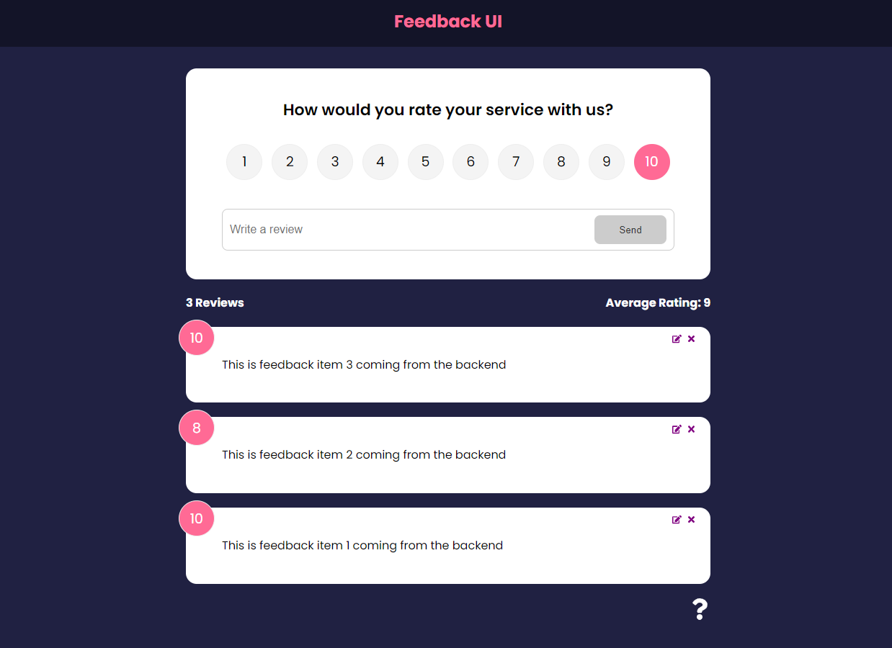

# React Feedback UI — React 18

Sample data retrieved from JSON file.

# Table of Contents

- [React Feedback UI — React 18](#react-feedback-ui--react-18)
- [Table of Contents](#table-of-contents)
- [Application Images](#application-images)
- [Instructions](#instructions)
- [Packages](#packages)

# Application Images

<p align="center" >
 
</p>

# Instructions

- Clone repo
- Install dependencies by running `npm install`
- Run `npm start` to run the application in development mode

# Packages

```
├── @testing-library/jest-dom@5.16.4
├── @testing-library/react@13.3.0
├── @testing-library/user-event@13.5.0
├── react-dom@18.1.0
├── react-icons@4.4.0
├── react-scripts@5.0.1
├── react@18.1.0
├── uuidv4@6.2.13
└── web-vitals@2.1.4

```
